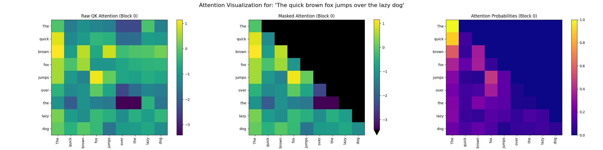

# tinygpt2

A reference implementation of GPT-2 in pure Python. Download the weights from
HuggingFace and performs inference just using NumPy. Really only useful for as
a teaching tool, don't actually use this for anything.

* [GPT2 Safetensors](https://huggingface.co/openai-community/gpt2/blob/main/model.safetensors)
* [Download Link](https://huggingface.co/openai-community/gpt2/resolve/main/model.safetensors) ( 548 MB )

Also need to download the encoder and vocab files `vocab.bpe` and `encoder.json`


## Running

```bash
# Install dependencies
poetry install

# Run inference examples
poetry run python example.py
```

## Structure

The core logic is split into several files:

* [`gpt2_tensors.py`](tinygpt2/gpt2_tensors.py) - Loads the tensors into layer forms that can be used for inference
* [`gpt2_ops.py`](tinygpt2/gpt2_ops.py) - Implements the GPT-2 primitives (gelu, layernorm, softmax, etc.)
* [`gpt2_run.py`](tinygpt2/gpt2_run.py) - Loads the weights and runs inference

In addition, the following files are included:

* [`encoder.py`](tinygpt2/encoder.py) - The BPE encoder from the original GPT-2 repository
* [`tokens.py`](tokens.py) - Example of how to use the encoder
* [`gpt2_minimal.py`](tinygpt2/gpt2_minimal.py) - The GPT-2 model in a single function
* [`gpt2_viz.py`](tinygpt2/gpt2_viz.py) - Visualize the attention patterns of the model

In the model directory, you will find the following files:

* [`config.json`](model/config.json) - The GPT-2 model configuration
* `model.safetensors` - The model weights
* `vocab.bpe` - The BPE vocab from the original GPT-2 repository
* `encoder.json` - The encoder json from the original GPT-2 repository

## Visualization

The attention patterns of the model can be visualized using the `gpt2_viz.py` script. This will generate a heatmap of the attention patterns for a given input sequence.



## License

MIT License
